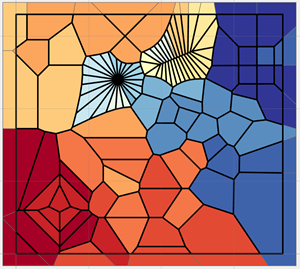

# NumPy and Geometry

----

<!--- This is a comment -->
<!--- https://dan-patterson.github.io/numpy_geometry/ -->

<!---  -->
<!---  -->
<!--- The line below is a relative reference.  Make sure that the subdir doesn't begin with a / -->

**Documentation Links**

* [Geo array Backgrounder](/Docs/Backgrounder.md)

* [Geo array Helper functions](/Docs/Helper_functions.md)

* [Script descriptions](/Docs/Scripts_desc.md)

* [npGeom toolbox description](/Docs/npGeomTools.md)

* [Multipart shapes](/Docs/Multipart_shapes.md)

**NOTE**

1 This is the main working repository for *arcpro_npg* aka, *Free_tools*.  I update that when major work is complete here.

2 See the **Docs** folder for other documentation, or click on the links above.

3 The **arcpro_npg** folder contains the scripts associated with the **Geo** array, a subclass of a *numpy* ndarray.  The script, *tbx_tools.py* is the controlling script associated with the *npGeom.tbx* toolbox.

----
A numpy geometry class and functions that work with arcpy and ESRI featureclasses is provided here to facilitate working with vector geometry using the ndarray as its base.

This is a work in progress, so bear with me.  The intent of the Geo class is to treat the geometry of featureclasses as one entity.  See **npGeo.py** in subsequent sections for details.  Converting esri's arcpy geometry objects to array representations is contained in **npg_io.py**. Most approaches I have see so far tend to construct the geometric representations of geometries using some variant of arcpy cursors.

When trying to work with numpy and the geometries, this creates problems since geometry is rarely a collection of simple shapes (eg. rectangles, circles, triangles).  Object arrays containing the coordinates are the norm.  An object array is created when the number of points per feature and/or feature part are not uniform.  For example, a square with a triangular hole in it, will have an outer ring, oriented clockwise consisting of a list of 5 points with the first and last point being the same.  The triangular hole will be represented by 4 points oriented counterclockwise.  Now that arrangement of points can be used to represent a polygon, a closed-loop polyline or a multipoint.  The same points can be used to represent 3 distinctly different geometric objects.

What I set out to do was create a uniform 2D array of coordinates and a companion array which denotes the feature ID and the from-to point pairs.  This is similar to the FeatureClassToNumPy array approach, but that particular function and its inverse, are only useful for simple singlepart geometries.

I will document and build on these tools set with examples.  
Generally, I am only working with featureclasses stored in a file geodatabase.  There are tools to derive geometries from geojson format or other formats capable of generating array-like structures.

----
**Some links**

*2020*

[Dissolve Boundaries](https://community.esri.com/t5/python-blog/dissolve-boundaries/ba-p/1011337)

[Conda, the dependency trail](https://community.esri.com/t5/python-blog/conda-the-dependency-trail/ba-p/904040)

[Densify by distance](https://community.esri.com/t5/python-blog/densify-by-distance/ba-p/1004894)

[Thiessen/Voronoi and Delaunay](https://community.esri.com/people/danretired/blog/2020/06/16/free-advanced-tools-thiessen-polygons-delaunay-triangulation)

[Point tools](https://community.esri.com/people/danretired/blog/2020/05/15/point-tools-for-pro)

[Polyline/Polygon tools](https://community.esri.com/people/danretired/blog/2020/05/19/polygonpolyline-tools-for-pro)

[Table tools](https://community.esri.com/people/danretired/blog/2020/05/18/free-tools-for-arcgis-pro-table-tools)

[Buffer ... Geometry Mysteries](https://community.esri.com/blogs/dan_patterson/2020/01/27/buffer-geometry-mysteries)

[Point in Polygon ... Geometry Mysteries](https://community.esri.com/blogs/dan_patterson/2020/02/18/point-in-polygon-geometry-mysteries)

*2019*

[Geometry in NumPy](https://community.esri.com/blogs/dan_patterson/2019/03/17/geometry-in-numpy-1)

[Geometry, Arcpy and NumPy](https://community.esri.com/blogs/dan_patterson/2019/04/10/geometry-arcpy-and-numpy-2)

[Deconstructing poly* features](https://community.esri.com/blogs/dan_patterson/2019/04/10/geometry-deconstructing-poly-features-3)

[Reconstructing poly* features](https://community.esri.com/blogs/dan_patterson/2019/04/17/geometry-reconstructing-poly-features-4)

[Attributes.. the other bits](https://community.esri.com/blogs/dan_patterson/2019/04/17/geometry-attributes-actually-the-other-bits-5)

[Don't believe what you see](https://community.esri.com/blogs/dan_patterson/2019/05/09/geometry-dont-believe-what-you-see-6)

[Geometry: forms of the same feature](https://community.esri.com/blogs/dan_patterson/2019/05/13/geometry-forms-of-the-same-feature-7)

[Links to the script documentation](https://github.com/Dan-Patterson/npGeo/blob/master/Scripts/README.md)

